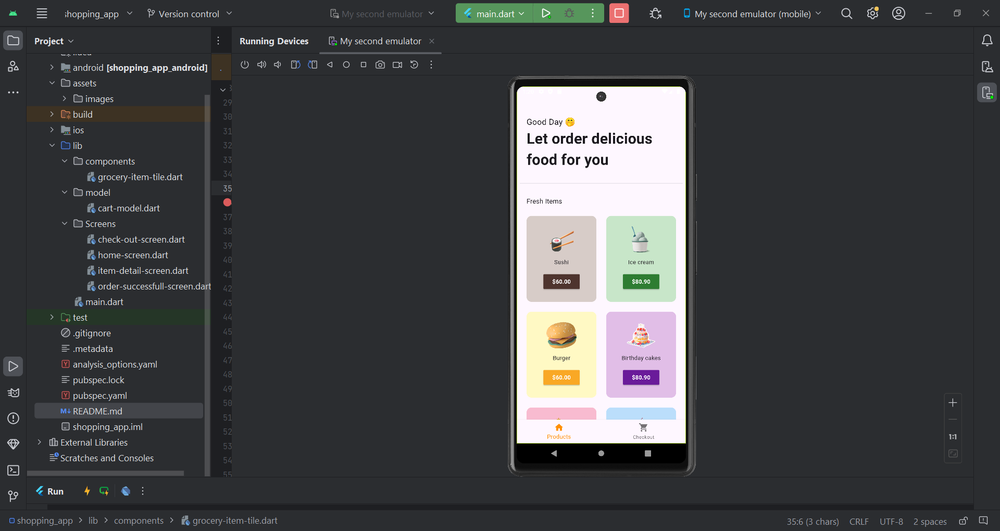
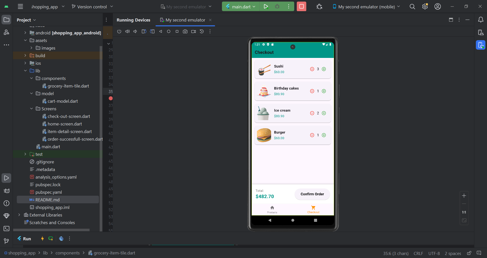
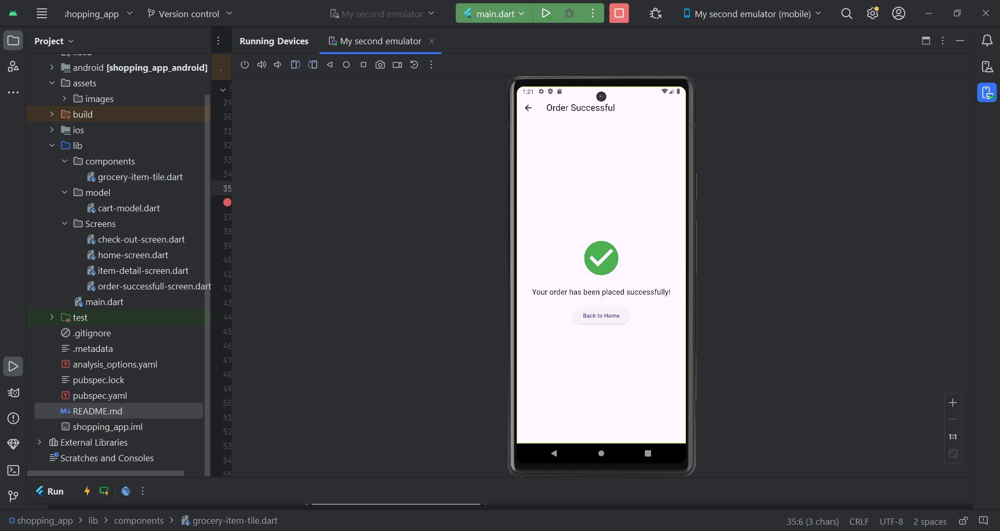

# Simple Shopping App
A simple shopping app built with Flutter. The app includes a bottom navigation bar, a products list, a checkout screen, adding/removing items to/from checkout, and an order successful screen.

## Table of Contents

- [Features](#features)
- [Installation](#installation)
- [Usage](#usage)
- [Screenshots](#screenshots)
- [APK Download](#apk-download)
- [Contributing](#contributing)
- [License](#license)
- [Acknowledgements](#acknowledgements)

## Features

- Bottom navigation bar
- Products list
- Add/Remove items to/from checkout
- Checkout screen
- Order successful screen

## Installation

To get a local copy up and running, follow these simple steps.

### Prerequisites

- Flutter SDK: [Flutter installation guide](https://flutter.dev/docs/get-started/install)
- A code editor, such as [Visual Studio Code](https://code.visualstudio.com/) or [Android Studio](https://developer.android.com/studio)

### Installation Steps

1. Clone the repository:
   ```sh
   git clone https://github.com/veraline/Simple-Shopping-App.git

2. Navigate to the project directory:
   cd shopping-app

3. Install dependencies:
   flutter pub get

4. Run the app:
   flutter run

## Usage

1. Open the app on your device or emulator.

2. Browse the products list.

3. Add items to your cart by clicking on the "Add" button.

4. Proceed to checkout by clicking the "Checkout" button.

5. Confirm your order on the checkout screen.

## Screenshots
Here are some screenshots of the app:

### Home Screen



### Check Out Screen


### Order Successful Screen


## Apk Download

You can download the APK file to install the app on your Android device from the link below:
[Download APK](app-armeabi-v7a-release.apk)

## License
Distributed under the MIT License. See LICENSE for more information.

## Acknowledgements
  Flutter
  Appetize.io


